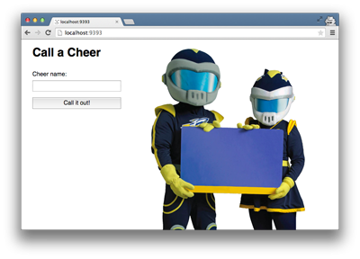
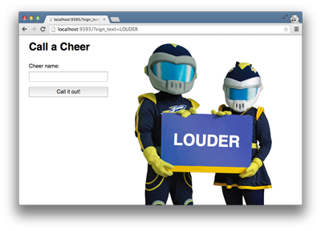

# Cheering Mascot (Талисман команды, подбадривающий игроков) 

## Общие сведения

Мы создадим очень простое веб-приложение с помощью [Express](https://expressjs.com), упрощенной платформы для создания веб-приложений на JS. Мы будем изучать, как передавать данные при выполнении HTTP-запросов, а также как получить доступ к данным, которые были переданы с запросом. Мы рассмотрим запросы `GET`и `POST`.

### Модуль подбадривающего талисмана
Данная задача представляет собой веб-версию задачи построения в JS Талисмана команды, подбадривающего игроков. В случае, если кто-либо не знаком с выполнением данной задачи или ему/ей необходимо вспомнить, вот обзор.

| CHEER NAME      | SIGN TEXT      |
| :-------------: | :------------: |
| RED HOT         | H-O-T!         |
| DO IT AGAIN     | Go, Fight, Win |
| 2 BITS          | Holler!        |
| STOMP YOUR FEET | STOMP!         |


  *Таблица 1*.  Подбадривающие приветствия, для которых у талисмана есть знаки.

Мы задаем какие-то подбадривающие приветствия, и у нас есть талисман, помогающий нам, удерживая знаки, соответствующие нашим подбадривающим приветствиям. У талисмана есть только знаки для нескольких подбадривающих приветствий. Талисман будет удерживать соответствующий знак, если мы закричим название приветствия, которое хотим услышать (т.е. все, напечатанные заглавными буквами). Но, если мы выкрикнем приветствие, для которого у талисмана нет знака, или если мы не выкрикнем имя приветствия достаточно громко для того, чтобы талисман услышал, то талисман будет держать общий знак "Go Team!" (Команда, вперед!).

Модуль `Mascot` (подбадривающего талисмана) необходимо создать в app/models/mascot.js. Целью модуля является определение знака, который будет держать талисман, исходя из названия заданного подбадривающего приветствия. 

### Общая схема алгоритма программы Express 

Инициализируйте приложение Express следующим образом:
```sh
npm install express-generator -g
express --view=hbs
npm install
```


## Releases
### Пререлиз: Запуск сервера
Чтобы запустить сервер, выполните следующую команду из корневого каталога приложения:
```js
 DEBUG=* npm start
```
*Рисунок 1*.  Код для запуска сервера.


### Release 0: Зайти на главную страницу



*Рисунок 3*.  Скриншот главной страницы.

Теперь мы можем зайти в наше веб-приложение. Мы можем использовать хост `127.0.0.1`, или ` localhost:3000`, который всегда ссылается на *текущий компьютер*. Откройте браузер и перейдите на страницу http://localhost:3000. Наша страница должна выглядеть примерно так, как показано на рисунке 3.

Итак, что здесь происходит? Когда мы перешли на http://localhost:3000, браузер отправил HTTP-запрос на сервер, который мы запустили. Более конкретно, он сделал запрос `GET` к корневому URL.

```js
const express = require('express');
const app = express();

app.get('/', function (req, res) {
  res.send('Hello World!');
});
```
Рисунок 4.  Определение обработчика GET в Express.

Наш сервер знает, как обрабатывать этот запрос. Мы передаем методу путь, который в этом случае `"/"`, и представляет собой корневой URL. Мы также передаем блок(функцию). В общем, мы говорим, что когда запрос `GET` делается на этот конкретный путь, выполните данный блок кода. 

Вызов `res.send()` возвращает строку `Hello World!`. Возвращаемое значение блока становится телом ответа, который наш сервер отправит обратно в браузер.


### Release 1: Пишем слова на Знаке

На знаке, который держит наш талисман, нужно написать несколько слов. Мы хотим, чтобы текст знака был динамичным. Помните, мы собираемся выкрикивать ура, и наше приложение определит соответствующий знак.

Мы начнем с рассмотрения того, как передавать данные при создании `GET`-запроса. Мы собираемся использовать [строку запроса], то есть, [строку запроса](http://en.wikipedia.org/wiki/Query_string). Проще говоря, мы добавим некоторые данные в конец нашего URL.

```text
http://somesite.com/?first_name=Ariel&last_name=Cyrillus
```
*Рисунок 5*. Пример URL с добавленной строкой запроса.

Строка запроса смещается от остальной части URL с помощью `?`. После того, как `?` станет парами «ключ-значение»; пары разделяются символом `&`. Каждая пара «ключ-значение» - это отдельный параметр строки запроса. В строке запроса на рисунке 5 мы передаем данные с именем Ariel и фамилией Cyrillus.



*Рисунок 6*. Скриншот главной страницы с текстом `sign_text=LOUDER`, переданным в строке запроса.

Мы будем использовать ту же технику, чтобы управлять словами, которые появляются на знаке нашего талисмана. Мы добавим пару ключевых значений в нашу строку запроса. Ключ должен быть `sign_text`. Давайте дадим ключу значение `LOUDER` (ГРОМЧЕ). В браузере перейдем к `http://localhost:3000/?sign_text=LOUDER`. Теперь на знаке должен быть текст (см. Рис. 6).


В Release 0 мы обсудили обработчик `GET`, который мы определили для запросов, внесенных в корневой путь нашего приложения. В блоке, который выполняется, когда `GET`-запрос делается на корневой путь (см. Рис. 4), нам еще предстоит обсудить строку `let sign_text = req.query.sign_text`.

```js
sign_text: "LOUDER"
```

*Рисунок 7*.

Когда HTTP-запросы поступают на наш сервер, становятся доступными параметры строки запроса. Пары «ключ-значение» добавляются к req.query. В нашем примере, у req.query ключ `sign_text`. Значение этого ключа - это строка `LOUDER`. (См. Рис. 7) 

У нас есть доступ к данным, переданным в строке запроса, но что мы делаем с ними? Мы обращаемся к значению ключа `sign_text` (то есть, `LOUDER`) и присваиваем это значение переменной  `sign_text`.

```text
{{#if sign_text}}
  <span>{{sign_text}}</span>
{{/if}}
```
*Рисунок 8*. Фрагмент кода шаблонизатора [handlebars-js](http://handlebarsjs.com/).

Когда мы назначаем переменную в блоке, эта переменная доступна внутри шаблона.


### Release 2:  Используйте форму, чтобы выкрикивать подбадривающие приветствия

Теперь пришло время выкрикивать подбадривающие приветствия. Помните, мы хотим указать название приветствия, и наше приложение определит, какой знак будет держать талисман. 

Мы будем использовать форму для отправки названия подбадривающего приветствия. В `app/views/index.js` мы определяем форму, а также мы даем форму некоторым атрибутам. У формы есть `метод`, который представлен посредством `post` и `action`, который установлен на `"/cheers"`. Эти атрибуты объединяются, чтобы определить, что происходит при отправке формы. Отправка этой формы подскажет браузеру сделать запрос `POST` на путь `/cheers`.

Когда форма отправляется, данные, введенные в форму, отправляются как часть запроса. Поля ввода и их значения объединяются для формирования строки текста, форматированной как строка запроса, которая добавляется в тело запроса.

Введите название подбадривающего приветствия в форму, отправьте форму и посмотрите на ответ, отображаемый в браузере.

К сожалению, обработчик не обрабатывает запрос так, как мы хотим. Нам необходимо сделать следующее, чтобы переписать обработчик. 

1. Узнайте, какое название подбадривающего приветствия было отправлено с формой.
2. Определите, какой знак должен держать талисман исходя из названия приветствия. Помните, что эта работа может быть делегирована модулю `Mascot` (подбадривающего талисмана).
3. Перенаправить браузер на главную страницу, добавив строку запроса, содержащую текст для отображения на знаке. Когда форма отправлена, браузер должен в конечном итоге оказаться в `http://localhost:3000/?sign_text=foobar`, где `foobar` - любой текст, который должен появиться на знаке. Для ознакомления прочитайте документацию Express в [Express documentation][].


## Заключение
Мы совершили беглый тур по HTTP и Express: как обращаться с запросами `GET` и` POST`, как передавать данные с помощью запроса `GET`, как данные в форме отправляются как часть` POST`-запроса и т.д. От такого объема информации голова идет кругом. К счастью, мы собираемся много работать с Express для создания веб-приложений, и мы будем все более и более комфортно себя чувствовать в работе со всеми этими материалами.

[Express documentation]: http://expressjs.com
